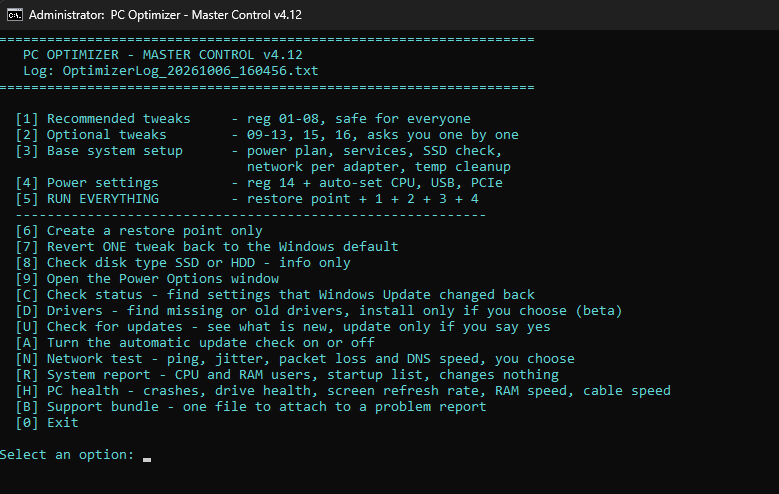
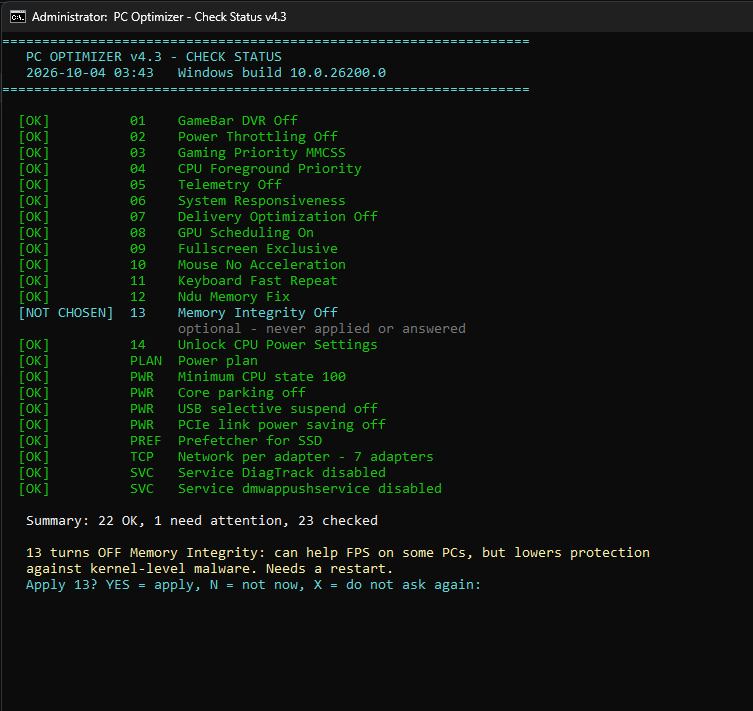

# win11-optimizer

  

The main menu (a preview, nothing to install to see it). / หน้าตาของเมนูหลัก

## Download / ดาวน์โหลด

### [Download the latest ZIP (click here) / ดาวน์โหลดไฟล์ ZIP ล่าสุด (กดที่นี่)](https://github.com/Kensukeimagery/win11-optimizer/releases/latest/download/win11-optimizer.zip)

1. Click the link above. The ZIP downloads by itself, no GitHub account needed. / กดลิงก์ด้านบน ไฟล์ ZIP จะโหลดทันที ไม่ต้องมีบัญชี GitHub
2. Right-click the ZIP > **Extract All**, then open the extracted folder. Do not run files from inside the ZIP. / คลิกขวาที่ ZIP > **Extract All** แล้วเปิดโฟลเดอร์ที่แตกออกมา อย่ารันไฟล์จากในไฟล์ ZIP
3. Read the manual in `docs/` first (English or Thai), then follow the quick start below. / อ่านคู่มือในโฟลเดอร์ `docs/` ก่อน (มีทั้งไทยและอังกฤษ) แล้วทำตามขั้นตอนเริ่มใช้งานด้านล่าง

Link not working? Use the green **Code** button on this page > **Download ZIP**. / ถ้าลิงก์ใช้ไม่ได้ ให้กดปุ่มสีเขียว **Code** ในหน้านี้ > **Download ZIP**

> **Notice for users of v4.6 or older / ผู้ใช้ v4.6 หรือเก่ากว่า:** the old 
epair-tools\Deep_Clean_Junk_Files.bat selected the Disk Cleanup categories *Downloads* and *Recycle Bin*, which can delete files you want to keep. Please update to v4.7 or later and check your Downloads folder. / สคริปต์ล้างไฟล์ขยะรุ่นเก่าเลือกหมวด *Downloads* และ *Recycle Bin* ของ Disk Cleanup ซึ่งอาจลบไฟล์ที่คุณต้องการเก็บ กรุณาอัปเดตเป็น v4.7 ขึ้นไป และตรวจโฟลเดอร์ Downloads ของคุณ

After the first download you do not need to come back here: press **U** in the main menu to update (see Updating). / หลังโหลดครั้งแรก ไม่ต้องกลับมาหน้านี้อีก กด **U** ในเมนูหลักเพื่ออัปเดต (ดูหัวข้อ Updating)

---

[ภาษาไทย](#ภาษาไทย) | [English](#english)

---

## English

A small, transparent set of batch/registry scripts to tune Windows 11 for gaming and lower background load. Every change lives in a readable `.reg` file, is backed up before it is applied, and can be reverted one by one.

> **Use at your own risk.** These scripts edit the registry and power settings. Use them only on your own PC. Create a restore point first (the script offers to). Some antivirus tools may flag `.bat` files that edit the registry; read the files before running.

### Quick start
1. Download the ZIP (see the link at the top), extract it, and **keep all folders next to the scripts**.
2. Right-click `1_Start_Here - PC_Optimizer_Master (Run as Administrator).bat` > **Run as administrator**.
3. Press `5` (restore point + everything). Answer the Y/N questions for the optional tweaks.
4. Restart Windows.
5. Later (for example after a big Windows update) run `3_Check_Status` to find settings that were reset.

### Updating
Press `U` in the main menu, or run `6_Check_For_Updates`. It shows what is new and installs the update **only if you say yes**. The download is verified against a SHA-256 checksum, the old version is saved to `Backup\update_<old>_<time>` and is put back automatically if anything fails. Your Backup folder, logs and reports are never touched. The menu asks once whether it may check automatically when it opens (press `A` to change that later). Going from v4.5 or older to v4.6 or newer needs one manual download; after that the tool updates itself.

### If Windows warns you
Files downloaded from the internet carry a "from the internet" mark, so Windows SmartScreen or your antivirus may warn about `.bat` files that change settings. That is expected for this kind of tool.
- To avoid a warning for every file: right-click the downloaded ZIP > **Properties** > tick **Unblock** > OK, and only then extract it.
- Read the scripts first (they are plain text). If you do not trust a file, do not run it.
- Never turn your antivirus off for this tool.

### Layout
| Path | Purpose |
|---|---|
| `docs/` | Manuals (PDF, English and Thai): run order, what each .reg does, manual Windows settings, references; plus the NVIDIA driver settings guide (`GPU_Driver_Guide_EN.pdf` / `_TH.pdf`). HTML sources are in `docs/src/` |
| `1_Start_Here ... .bat` | Main menu |
| `2_Revert_Everything ... .bat` | Restore to the `Before_PC_Optimizer` restore point |
| `3_Check_Status ... .bat` | Check which tweaks are still applied |
| `4_Network_Test.bat` | Ping, jitter, packet loss and DNS speed; changes nothing unless you pick a DNS at the end |
| `5_System_Report.bat` | Read-only report of CPU/RAM users, startup programs, disk space, GPU driver age (no admin needed) |
| `6_Check_For_Updates.bat` | Looks for a newer version and updates only if you say yes (no admin needed) |
| `7_Driver_Check ... .bat` | BETA: finds devices with no driver and Windows Update driver updates; installs only if you choose; menu choice C cleans old driver versions |
| `S_PC_Specs.bat` | Your PC on ONE page in plain words (processor, RAM, graphics card, screens, drives, network, Secure Boot and TPM); no serial numbers or addresses, so it can be shared (no admin needed) |
| `8_PC_Health.bat` | Read-only health check: blue screens and crashes, drive health, battery wear, screen refresh rate, RAM speed, network cable speed (no admin needed) |
| `9_Support_Bundle.bat` | Puts the version, reports and logs into ONE file to attach to a problem report; private details are replaced, nothing is sent (no admin needed) |
| `L_Clean_Up.bat` | Old reports and backups: shows what is there and removes old files only when you choose (no admin needed) |
| `Logs/` | Created when you run a tool: every log and report. The newest 3 of each kind are kept, older ones are removed automatically |
| `reg/` | Tweaks: `1_Recommended` (01-08), `2_Optional` (09-13, 15), `3_Power` (14) |
| `reg_undo/` | One undo file per tweak (Windows defaults) |
| `tools/` | PowerShell helpers used by the menu (keep this folder) |
| `repair-tools/` | Deep clean, network reset, Bluetooth fix, DISM + SFC |

### Main menu
`1` Recommended, `2` Optional 09-13, 15, 16 (one by one), `3` Base setup (power plan, services, SSD/HDD check, temp cleanup), `4` Power settings, `5` Everything, `6` Restore point only, `7` Revert one tweak, `8` Disk type, `9` Power Options, `C` Check status, `D` Drivers (beta), `U` Check for updates, `A` Automatic update check on/off, `N` Network test, `R` System report, `S` PC specs, `H` PC health, `B` Support bundle, `L` Clean up old reports and backups.

### Honest expectations
These tweaks give small, situational gains. GPU driver updates, in-game settings, XMP/EXPO and cooling matter far more. Items without official Microsoft documentation are marked as community-sourced in the manual's References page.

### Requirements
Windows 11 (build 22000 or newer), administrator rights. Built for desktops: on a laptop the menu advises against tweaks 02 and 16, and on older Windows it warns first. Manuals: [English](docs/Manual_EN_v4.15.pdf) and [Thai](docs/Manual_TH_v4.15.pdf). NVIDIA driver settings, explained one by one: [English](docs/GPU_Driver_Guide_EN.pdf) and [Thai](docs/GPU_Driver_Guide_TH.pdf). The scripts print English.

### Problems or ideas
Open an [issue](https://github.com/Kensukeimagery/win11-optimizer/issues/new/choose). The form asks for your version and Windows build and tells you which log files to attach (check them for anything private first).

### License
MIT, see `LICENSE`.

---

## ภาษาไทย

ชุดสคริปต์ .bat/.reg ที่โปร่งใส สำหรับปรับ Windows 11 ให้เหมาะกับการเล่นเกมและลดโหลดเบื้องหลัง ทุกการเปลี่ยนแปลงอยู่ในไฟล์ .reg ที่เปิดอ่านได้ ถูกสำรองก่อนแก้ และย้อนกลับได้ทีละข้อ

> **ใช้ด้วยความเสี่ยงของตัวเอง** สคริปต์แก้ registry และ power settings ใช้กับเครื่องของตัวเองเท่านั้น สร้างจุดคืนค่าก่อนเสมอ (สคริปต์ถามให้) แอนตี้ไวรัสบางตัวอาจเตือนไฟล์ .bat ที่แก้ registry ควรเปิดอ่านก่อนรัน

### เริ่มใช้งาน
1. ดาวน์โหลดไฟล์ ZIP (ลิงก์อยู่ด้านบนสุด) แตกไฟล์ และ**เก็บทุกโฟลเดอร์ไว้ข้างสคริปต์**
2. คลิกขวา `1_Start_Here - PC_Optimizer_Master (Run as Administrator).bat` > **Run as administrator**
3. กด `5` (จุดคืนค่า + ทุกอย่าง) แล้วตอบ Y/N ข้อ Optional
4. รีสตาร์ทเครื่อง
5. หลังอัปเดต Windows ใหญ่ๆ ให้รัน `3_Check_Status` เพื่อดูว่าค่าไหนถูกรีเซ็ต

### การอัปเดต
กด `U` ในเมนูหลัก หรือรัน `6_Check_For_Updates` โปรแกรมจะแสดงว่ามีอะไรใหม่ และติดตั้ง**เฉพาะเมื่อคุณตอบตกลง** ไฟล์ที่ดาวน์โหลดถูกตรวจกับค่า SHA-256 เวอร์ชันเดิมถูกเก็บไว้ที่ `Backup\update_<เวอร์ชันเดิม>_<เวลา>` และใส่กลับให้อัตโนมัติถ้ามีอะไรผิดพลาด โฟลเดอร์ Backup, log และรายงานของคุณไม่ถูกแตะ เมนูจะถามหนึ่งครั้งว่าให้ตรวจอัตโนมัติตอนเปิดไหม (กด `A` เพื่อเปลี่ยนภายหลัง) การอัปเดตจาก v4.5 หรือเก่ากว่าเป็น v4.6 ขึ้นไปต้องดาวน์โหลดเองหนึ่งครั้ง หลังจากนั้นโปรแกรมอัปเดตตัวเองได้

### ถ้า Windows เตือน
ไฟล์ที่ดาวน์โหลดจากอินเทอร์เน็ตมีเครื่องหมาย "มาจากอินเทอร์เน็ต" Windows SmartScreen หรือแอนตี้ไวรัสจึงอาจเตือนไฟล์ `.bat` ที่เปลี่ยนการตั้งค่า ซึ่งเป็นเรื่องปกติของเครื่องมือประเภทนี้
- เพื่อไม่ให้เตือนทุกไฟล์: คลิกขวาไฟล์ ZIP ที่ดาวน์โหลด > **Properties** > ติ๊ก **Unblock** > OK แล้วค่อยแตกไฟล์
- เปิดอ่านสคริปต์ก่อน (เป็นข้อความธรรมดา) ถ้าไม่ไว้ใจไฟล์ไหน อย่ารัน
- อย่าปิดแอนตี้ไวรัสเพื่อใช้เครื่องมือนี้

รายละเอียดแต่ละไฟล์ ลำดับการรัน และการตั้งค่า Windows เพิ่มเติมอยู่ในคู่มือ PDF: [ภาษาไทย](docs/Manual_TH_v4.15.pdf) | [English](docs/Manual_EN_v4.15.pdf)

คู่มือตั้งค่าไดรเวอร์การ์ดจอ NVIDIA ทีละข้อ (แต่ละค่าคืออะไร ค่าแนะนำ ผลต่างกันอย่างไร): [ภาษาไทย](docs/GPU_Driver_Guide_TH.pdf) | [English](docs/GPU_Driver_Guide_EN.pdf)

### ความคาดหวังที่เป็นจริง
tweak เหล่านี้ให้ผลเล็กน้อยเฉพาะสถานการณ์ ไดรเวอร์การ์ดจอ การตั้งค่าในเกม XMP/EXPO และการระบายความร้อนสำคัญกว่ามาก รายการที่ไม่มีเอกสารทางการของ Microsoft ระบุไว้ในหน้าแหล่งอ้างอิงของคู่มือ

### เจอปัญหาหรือมีไอเดีย
เปิด [issue](https://github.com/Kensukeimagery/win11-optimizer/issues/new/choose) แบบฟอร์มจะถามเวอร์ชันและ build ของ Windows และบอกว่าควรแนบไฟล์ log ไหน (ตรวจก่อนว่าไม่มีข้อมูลส่วนตัว)

### สัญญาอนุญาต
MIT ดูไฟล์ `LICENSE`
